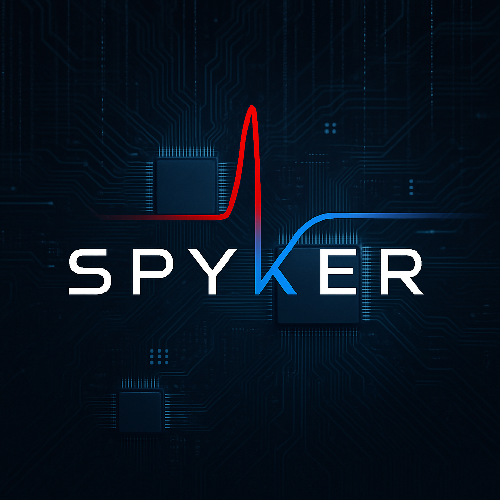

# Spyker

Spyker is a fast software library for spiking neural networks (SNNs). It uses a hand-optimized C++/CUDA core alongside optimized computational backends from Intel and NVIDIA with easy-to-use Python bindings. This means you can test new learning rules in a notebook, run large models quickly on a workstation, or use it in production without rewriting code. Spyker is made for researchers and engineers who need biologically realistic SNN parts (filters, learning rules, sparse encodings) but still want the speed and flexibility of modern deep-learning tools.

> **In short:** Spyker brings event-driven, STDP-capable networks to regular CPUs and GPUs. Its API feels like PyTorch/NumPy but runs with the power and control of native C++.

## Why Spyker?

The research behind Spyker shows what makes it different from other SNN tools:

* **Speed first** -> The backend is written from scratch in C++/CUDA to cut memory use and reduce GPU kernel calls. This makes it several times faster than PyTorch-based SNN libraries. Tasks that used to take hours now finish in minutes on standard GPUs.
* **Learning rules** -> It includes ready-to-use spike-timing-dependent plasticity (STDP) and reward-modulated STDP (R-STDP). You can easily reproduce neuroscience experiments or test new rules. Backpropagation learning rule is also experimentally being tested.
* **Flexible data formats** -> Spyker works with both dense tensors (for layers like convolutions) and sparse spike streams. You can pick whichever fits your problem or even mix the two.
* **Seamless integration** -> The library has seemles interactions with PyTorch and Numpy and plays really well with them.
* **Simple API** -> The Python and C++ APIs mirror each other, so code you write in Python can be easily ported to C++.

## Main Features

* **Layer modules:** Filters (DoG, Gabor, Laplacian), ZCA whitening, convolution, fully connected layers, pooling, inhibition, spike coding/decoding, winner-take-all (WTA), temporal backprop, and more.
* **Plasticity tools:** Configurable STDP variants, integrate-and-fire spiking, event aggregation, and winner tracking utilities.
* **Device/runtime control:** Manage CUDA devices, memory, caching, and threading from Python or C++.
* **Interop tools:** Convert data between Spyker, NumPy, and PyTorch without copying. Helpers for image read/write, MNIST, and CSV data.
* **Docs, examples and tutorials:** Full installation notes, tutorials, Jupyter notebooks, and example implementations of famous networks.

## Installation (Quick Guide)

You need CMake ≥ 3.24 and a C++11 capable compiler. Optional backends include CUDA, cuDNN, oneDNN, and BLAS/MKL.

Example installs:

```bash
# CPU-only C++ build
git clone --recursive https://github.com/ShahriarRezghi/Spyker.git
cmake -S Spyker -B build -DCMAKE_BUILD_TYPE=Release \
  -DSPYKER_ENABLE_CUDA=OFF -DSPYKER_ENABLE_CUDNN=OFF
cmake --build build -j$(nproc)

# Python wheel
python -m pip install .

# Editable Python install
python -m pip install --editable .
```

See the documentation for advanced options like forcing MKL or selecting CUDA architectures.

# Documentation
You can see the documentation for installation, usage tutorial, and the C++ and Python interfaces [here](https://spyker.readthedocs.io/en/latest/index.html).

# Tutorials
You can take a look at the tutorials listed below to learn how to use the library.

+ [Tutorial 1: Spyker and PyTorch](./tutorials/spyker_and_pytorch.ipynb)
+ [Tutorial 2: Spyker and Numpy](./tutorials/spyker_and_numpy.ipynb)
+ [Tutorial 3: Sparse Spyker](./tutorials/sparse_spyker.ipynb)
+ [Tutorial 4: Other Functionalities](./tutorials/other_functionalities.ipynb)
+ [Tutorial 5: Rate Coding](./tutorials/rate_coding.ipynb)

# Examples
You can checkout example implementations of some networks in the [examples directory](./examples/). The example use the MNIST dataset, which is expected to be inside the `MNIST` directory beside the files, and the name of the files is expected to be `train-images-idx3-ubyte`, `train-labels-idx1-ubyte`, `t10k-images-idx3-ubyte`, `t10k-labels-idx1-ubyte`.

## Project Structure

```
3rd/         # Third-party libraries
docs/        # Documentation
examples/    # Example SNN pipelines
src/         # C++ core and CUDA kernels
src/python/  # Python package
tutorials/   # Tutorial Jupyter notebooks
```

## Future Work

The paper suggests extending Spyker by:

* Adding more learning rules
* Expanding sparse CUDA and neuromorphic support
* Adding more neuron/synapse models
* Exploring recurrent SNNs and event-based data (e.g., speech, DVS)

Contributions are always welcome!

## Contributing

Bug reports, features, and pull requests are welcome on the [GitHub tracker](https://github.com/ShahriarRezghi/Spyker/issues).

## License

Spyker is available under the [BSD 3-Clause License](./LICENSE).
